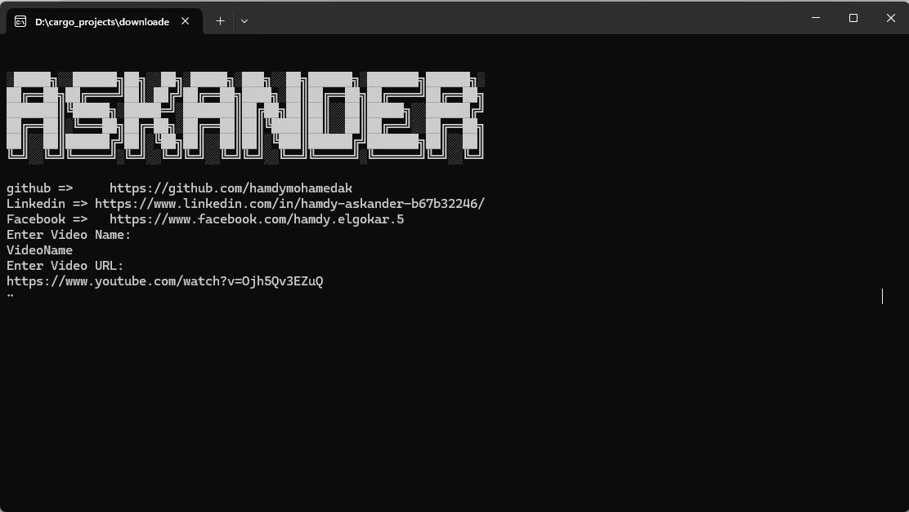

#  YouTube_Downloader
 tool can download videos from YourTube with Rust Language
# usage
EXE file:
1-type the video Name 
2- type the Video Link (URL)
# run project
1-git clone "https://github.com/hamdymohamedak/Rust_download_youTube.git"
-2 cd rust_download_youtube
-3 cargo run
you can edit code from main.rs at src folder
## Screenshots

